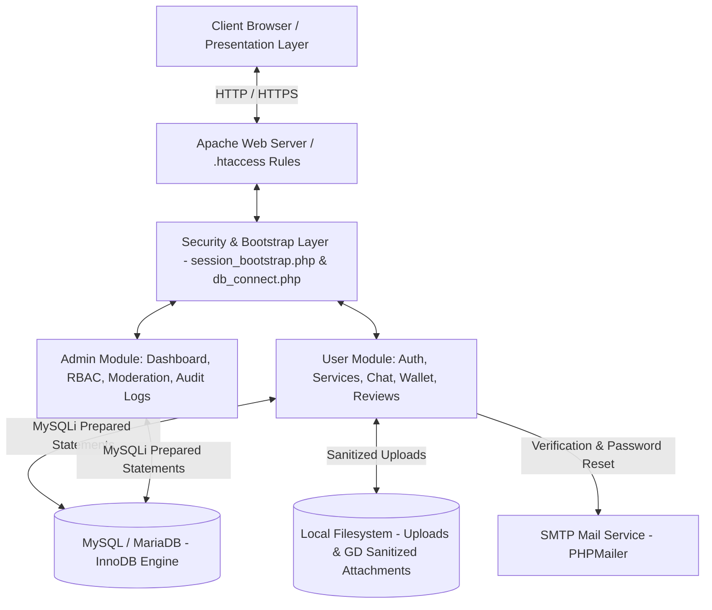

<div align="center">

# 🌟 Ethraa Platform (منصة إثراء)
### A Collaborative Peer-to-Peer Skills & Service Exchange Web Application

[العربية](README.ar.md) | **English**

[](https://www.php.net/)
[](https://www.mysql.com/)
[](https://getbootstrap.com/)
[-success?style=flat&logo=securityscorecard&logoColor=white)](#-security-architecture--hardening)

</div>

---

## 📖 Table of Contents

- [Project Overview](#-project-overview)
- [Key Features](#-key-features)
  - [User Features](#user-features)
  - [Admin Features](#admin-features)
- [How Ethraa Works (The Points Model)](#-how-ethraa-works-the-points-model)
- [User & Admin Flow](#-user--admin-flow)
- [Technology Stack](#-technology-stack)
- [System Architecture](#-system-architecture)
- [Project Directory Structure](#-project-directory-structure)
- [Database Schema & Architecture](#-database-schema--architecture)
- [Points & Wallet System](#-points--wallet-system)
- [Chat & Automated Content Moderation](#-chat--automated-content-moderation)
- [Security Architecture & Hardening](#-security-architecture--hardening)
- [Dynamic Security Verification Results](#-dynamic-security-verification-results)
- [Installation & Setup](#-installation--setup)
- [Configuration Guide](#-configuration-guide)
- [Production Deployment Recommendations](#-production-deployment-recommendations)
- [Future Roadmap](#-future-roadmap)
- [Project Status & Disclaimer](#-project-status--disclaimer)
- [Author & Credits](#-author--credits)

---

## 💡 Project Overview

**Ethraa (إثراء)** is an interactive peer-to-peer web platform engineered to foster community cooperation, knowledge transfer, and reciprocal skills sharing. Instead of relying on direct financial transactions, Ethraa implements a structured, server-authoritative **Points & Reputation Economy**. 

### The Problem It Solves
- **Monetization Barriers:** Many individuals possessing valuable academic, technical, or vocational skills lack a safe, non-commercial channel to exchange their expertise.
- **High Commercial Costs:** Students and entry-level freelancers often cannot afford expensive commercial rates for short consultations, debugging assistance, or design reviews.
- **Trust Deficit:** Informal social media exchanges lack structured accountability, dispute settlement, rating integrity, and privacy safeguards.

### The Ethraa Solution
Ethraa bridges this gap by awarding every newly verified user welcome points to request services. When users provide assistance to their peers, they earn points in return, creating a sustainable self-reinforcing ecosystem of mutual aid and professional networking.

---

## ✨ Key Features

### User Features
- **Account Registration & Verification:** Input validation tailored for Jordanian mobile numbers (`07xxxxxxxx`), age compliance checks ($\ge 18$ years), password complexity checks, and email verification token delivery via PHPMailer.
- **Authentication & Protection:** Secure password hashing with Bcrypt, automated 5-attempt / 15-minute brute-force lockout, session fixation defense (`session_regenerate_id`), and secure "Remember Me" token rotation.
- **Service Directory & Discovery:** Dynamic categorization (Main Categories and Sub-services), real-time client-side search, provider availability filtering, and live rating previews.
- **Service Booking & Request Lifecycle:** Interactive booking engine with provider schedule inspection, atomic conditional points deduction, daily booking quota limits, and concurrent active request limits.
- **Private Messaging (AJAX Polling):** Direct chat between requester and provider with AJAX polling, typing indicator broadcasts, secure image sharing (with image re-rendering via GD), and single-click message reporting.
- **Automated Content Moderation:** Rule-based regex detection for prohibited terms, off-platform contact sharing, and phone number leakage with automatic penalty escalation (warnings, strikes, and automated temporary bans).
- **Points & Transaction Ledger:** Visual wallet tracking available balance, incoming/outgoing points, detailed transaction log, and referral reward tracking.
- **Reviews & Rating Engine:** 5-star rating system with qualitative feedback, restricted strictly to completed requests with database-enforced single-review constraints.
- **Notification Center:** Real-time in-app alerts for request status changes, new messages, availability notifications, administrative announcements, and penalty alerts.
- **Dispute Appeals System:** Dedicated channel for suspended users to submit appeals directly to platform administrators.

### Admin Features
- **Centralized Analytics Dashboard:** Overview of total users, active requests, service distribution, completed points volume, pending disputes, and banned accounts.
- **User Moderation & Account Controls:** Complete user listing with search, filtering, detailed profile inspection, administrative point adjustments, manual account suspension, and ban lifting.
- **Service & Domain Management:** Interactive management for main categories and sub-services, including SVG icon associations and activation toggles.
- **Report & Dispute Resolution:** Triaged queue of user reports and chat message flags with single-click moderation actions (dismiss, warn, strike, or ban).
- **Appeals Adjudication:** Review user-submitted appeals, inspect ban histories, and restore accounts with automated notification dispatch.
- **Broadcast & System Notifications:** Send targeted individual alerts or system-wide broadcast notifications to all registered users.
- **Emergency Maintenance Mode:** Fast toggle to restrict platform access for routine maintenance while retaining administrative accessibility.
- **Comprehensive Audit Logging:** Automatic recording of all administrative actions with actor ID, action type, description, timestamp, and remote IP address.
- **Granular Role-Based Access Control (RBAC):** Super Admin and Admin role segregation with discrete permission assignments (`manage_users`, `manage_services`, `manage_notifications`, `manage_reports`, `manage_appeals`, `view_logs`, `manage_settings`, `manage_admins`).

---

## 🔄 How Ethraa Works (The Points Model)

```
[User A: Requester]                          [Ethraa Core Platform]                         [User B: Provider]
        │                                              │                                            │
        │─── 1. Submits Service Booking (1 Point) ────>│                                            │
        │                                              ├── Atomic Points Check & Deduction (A: -1)  │
        │                                              ├── Lock Active Request Concurrency          │
        │                                              ├── Create Request Record (Status: pending)  │
        │                                              │──────────────── 2. New Request Alert ─────>│
        │                                              │                                            │
        │                                              │<─── 3. Accepts Request (Status: accepted) ─│
        │<── 4. Booking Accepted Notification ─────────┤                                            │
        │                                              │                                            │
        │<================ 5. Secure Private Chat & File Sharing ================>│
        │                                              │                                            │
        │─── 6. Confirms Service Completion ──────────>│<─── 6. Confirms Service Completion ───────│
        │                                              ├── Dual-Confirmation Verified               │
        │                                              ├── Status Updated (Status: completed)       │
        │                                              ├── Atomic Points Transfer (B: +1)           │
        │                                              ├── Request Unlocked                         │
        │<── 7. Review Prompt Notification ────────────┤                                            │
        │                                              │                                            │
        │─── 8. Submits 1-Time Service Review ────────>├── Validated & Saved (UNIQUE constraint)    │
        │                                              │──────────────── 9. Review Alert ──────────>│
```

---

## 🗺️ User & Admin Flow

### User Journey
1. **Onboarding:** Registration $\rightarrow$ Account Verification via Email Link $\rightarrow$ Initial Login.
2. **Explore & Request:** Browse Service Catalog $\rightarrow$ Select Available Provider $\rightarrow$ Submit Booking Form.
3. **Collaboration:** Provider accepts $\rightarrow$ Direct Private Chat opens $\rightarrow$ AJAX-polled messaging & image exchange.
4. **Completion & Review:** Both parties confirm service delivery $\rightarrow$ Points credited to Provider $\rightarrow$ Requester submits rating & review.

### Administrator Journey
1. **Authentication:** Secure Admin Login $\rightarrow$ Credential & CSRF Verification $\rightarrow$ Session Permission Loading.
2. **Oversight:** Inspect Dashboard Metrics $\rightarrow$ Monitor Service Requests and User Growth.
3. **Moderation:** Review User Reports & Appeals $\rightarrow$ Apply disciplinary actions $\rightarrow$ Update Platform Settings.
4. **Auditability:** Every administrative modification is committed to `admin_logs` with actor IP address.

---

## 🛠️ Technology Stack

| Layer | Technologies / Libraries |
| :--- | :--- |
| **Backend Engine** | **PHP 8.0+** (Procedural Architecture, Native MySQLi with Prepared Statements) |
| **Database Engine** | **MySQL 8.0+ / MariaDB 10.4+** (InnoDB, Foreign Key Constraints, Atomic Row-Locking) |
| **Frontend Framework** | **HTML5**, **CSS3**, **Vanilla JavaScript (ES6+)**, **Bootstrap 5.3** |
| **UI Components & Icons** | **FontAwesome 6.4 (Free)**, **SweetAlert2 v11** |
| **Email Services** | **PHPMailer v7.0.2** (SMTP over TLS/SSL) |
| **Image Processing** | **PHP GD Extension** (Image sanitization, metadata stripping, re-rendering) |
| **Web Server** | **Apache 2.4** (with `mod_headers`, `mod_rewrite`, `.htaccess` security hardening) |

---

## 🏗️ System Architecture

Ethraa is constructed using a decoupled, lightweight Native PHP Web Architecture without heavy third-party framework overhead.



---

## 📂 Project Directory Structure

```text
Ethraa/
├── admin/                      # Administrative portal pages and controllers
│   ├── admin_functions.php     # RBAC helper functions & admin audit logging
│   ├── admin_login.php         # Admin authentication UI
│   ├── appeals.php             # User suspension appeals management
│   ├── audit_logs.php          # Administrative action audit trail
│   ├── dashboard.php           # Admin analytics dashboard
│   ├── handle_report_action.php# Disciplinary action handler
│   ├── manage_admins.php       # Admin account & granular permissions manager
│   ├── notifications.php       # Broadcast and targeted notifications dispatch
│   ├── reports.php             # User and chat message reports management
│   ├── services.php            # Main categories and sub-services manager
│   ├── settings.php            # Platform configuration & welcome points settings
│   ├── toggle_maintenance.php  # Fast AJAX toggle for platform maintenance mode
│   ├── user_details.php        # Deep user profile & transaction audit view
│   └── users.php               # User listing, filtering, and ban management
│
├── assets/                     # Static media and front-end dependencies
│   ├── css/                    # Custom stylesheets (home.css, style.css, dark_mode)
│   ├── js/                     # Custom JavaScript modules (chat, alerts, dark_mode)
│   ├── images/                 # Platform branding, icons, and SVG assets
│   └── PHPMailer/              # PHPMailer 7.0.2 mailing library
│
├── config/                     # Configuration and core bootstraps
│   ├── db_connect.php          # Database connection, security headers & timeout
│   ├── mail_config.example.php # Example template for SMTP mail credentials
│   ├── mail_config.php         # Local SMTP credentials (ignored in Git)
│   └── session_bootstrap.php   # Centralized session cookie hardening
│
├── database/                   # Database definitions
│   └── schema.sql              # Complete relational schema, indexes & constraints
│
├── includes/                   # Shared presentation templates
│   ├── public_footer.php       # Public facing footer
│   ├── public_header.php       # Public facing header
│   ├── user_header.php         # Authenticated user header
│   └── user_navbar.php         # Authenticated user responsive navigation bar
│
├── php/                        # Backend business logic & AJAX handlers
│   ├── admin_login_process.php # Admin authentication & lockout handler
│   ├── fetch_messages.php      # Polling endpoint for real-time private messages
│   ├── login_process.php       # User login, session fixation & lockout handler
│   ├── manage_notifications.php# AJAX endpoints for in-app notification actions
│   ├── moderation_system.php   # Automated rule-based content moderation engine
│   ├── process_booking.php     # Service booking & atomic points deduction handler
│   ├── process_new_password.php# Token-authenticated password reset processor
│   ├── register_process.php    # User registration & validation processor
│   ├── report_message.php      # Chat message reporting handler
│   ├── request_operations.php  # Service request operations (accept, reject, cancel, complete, review)
│   ├── save_time.php           # Provider availability schedule updater
│   ├── send_message.php        # Chat message dispatcher & GD file upload processor
│   ├── send_reset_link.php     # Password reset token generation & email dispatcher
│   ├── typing_status.php       # AJAX typing indicator update endpoint
│   ├── update_account.php      # User profile, phone, and password updater
│   └── wallet_system.php       # Wallet points calculations & referral helpers
│
├── uploads/                    # User-generated content storage
│   ├── .htaccess               # Execution denial for PHP and executable scripts
│   └── chat/                   # User-uploaded chat attachments
│       └── .htaccess           # Execution denial for chat attachments
│
├── user/                       # Authenticated user web pages
│   ├── api_check_user_service.php # Availability verification endpoint
│   ├── chat.php                # Real-time private chat UI
│   ├── login.php               # User login interface
│   ├── logout.php              # Secure user logout & token cleanup
│   ├── my_account.php          # Account management & availability settings
│   ├── my_services.php         # Provider service selection UI
│   ├── notifications.php       # In-app notifications feed
│   ├── register.php            # User registration interface
│   ├── requests.php            # Incoming and outgoing requests management
│   ├── services_list.php       # Service discovery & provider catalog
│   ├── user_home.php           # Authenticated user dashboard
│   ├── user_reviews.php        # Provider reviews and feedback listing
│   ├── verify.php              # Email verification landing page
│   └── wallet_history.php      # Points transactions ledger
│
├── .gitignore                  # Git repository exclusion rules
├── .htaccess                   # Root security headers & server configurations
├── about.php                   # About platform page
├── forgot_password.php         # Password recovery initiation page
├── guide.php                   # Platform usage guidelines & terms
├── index.php                   # Public landing page
├── maintenance.php             # Maintenance mode landing page
├── reset_password.php          # Password reset form
├── terms.php                   # Terms of service and privacy policy
├── README.md                   # Primary English documentation
└── README.ar.md                # Full Arabic documentation
```

---

## 🗄️ Database Schema & Architecture

The database is built on **MySQL/MariaDB** utilizing the **InnoDB** engine to support ACID transactions, row-level locking, and foreign key integrity.

### Core Tables & Responsibilities
- `users`: Core profile data, hashed credentials, points balance, session versions, failed attempt counters, and referral lineage.
- `admins`: Administrative accounts, roles (`super_admin`, `admin`), hashed credentials, and JSON-encoded granular permission sets.
- `services`: Hierarchical classification of Main Categories (`parent_id IS NULL`) and Sub-Services (`parent_id IS NOT NULL`).
- `requests`: The service transaction lifecycle (`pending`, `accepted`, `rejected`, `completed`, `cancelled`) with dual-confirmation flags.
- `messages`: Private chat history linked to `request_id` with sender/receiver IDs, message text, sanitized attachment paths, and read timestamps.
- `reviews`: Service feedback with rating stars (1-5), qualitative comment, and a strict `UNIQUE KEY (request_id)` constraint preventing duplicate reviews.
- `points_transactions`: Immutable financial ledger tracking all credit/debit operations, transaction reasons, and actor references.
- `notifications`: In-app notification queue with types, titles, messages, and read status flags.
- `reports`: User moderation reports detailing reported user, reporter, target message/request, and resolution status.
- `appeals`: Ban appeal submissions with user explanations, submission timestamps, and admin review status.
- `availability_subscriptions`: Subscription records for users requesting availability alerts when a provider goes online.
- `settings`: Key-value configuration store for platform-wide parameters (e.g., `maintenance_mode`, `welcome_points`).
- `admin_logs`: Immutable security audit trail recording all administrative operations with actor IP addresses.

---

## 💰 Points & Wallet System

Ethraa enforces a server-authoritative points mechanism to guarantee balance consistency:

1. **Welcome Bonus:** Upon successful account verification, users receive configured welcome points (default: 1 point).
2. **Service Reservation (Escrow):** When requesting a service, 1 point is atomically deducted from the requester:
   ```sql
   UPDATE users SET points = points - 1 WHERE user_id = ? AND points >= 1;
   ```
3. **Atomic Refund on Rejection/Cancellation:** If a provider rejects a request or the requester cancels a pending request, the point is immediately refunded within a database transaction.
4. **Service Delivery & Reward:** Upon mutual confirmation of completion by both parties:
   - Request status updates to `completed`.
   - 1 point is atomically added to the provider's wallet.
   - Both transactions are logged to `points_transactions`.
5. **Concurrency & Race Condition Defenses:** All balance-modifying operations utilize MySQL transactions (`begin_transaction`, `commit`, `rollback`) paired with `SELECT ... FOR UPDATE` row locks.

---

## 💬 Chat & Automated Content Moderation

- **Authorization Isolation:** Messages can only be fetched or dispatched by validated participants of the corresponding `request_id`.
- **Automated Rule-Based Content Moderation:**
  - Employs regex pattern matching against known harassment, profanity, and illicit exchange patterns.
  - Detects off-platform contact sharing (phone numbers, external communication invites).
  - Automatically records strikes and enforces progressive penalties (warnings $\rightarrow$ 3-day automated temporary bans).
- **Anti-Spam & Rate Limiting:** Enforces a 2-second cooldown on image uploads and throttles rapid-fire messaging.
- **Attachment Sanitization:** Uploaded files undergo MIME type inspection, extension whitelist filtering, and image re-rendering via PHP GD before saving to disk with 16-byte random hex filenames.

---

## 🛡️ Security Architecture & Hardening

Ethraa has been thoroughly hardened in accordance with **OWASP Top 10** security best practices:

### 1. Authentication & Session Defense
- **Password Protection:** Standardized `password_hash()` with `PASSWORD_DEFAULT` (Bcrypt) and secure verification with `password_verify()`.
- **Brute-Force Lockout:** Automatically locks accounts for 15 minutes after 5 consecutive failed attempts.
- **Session Fixation Resistance:** Triggers `session_regenerate_id(true)` immediately upon successful login.
- **Session Versioning & Invalidation:** Every user record contains a `session_version`. Changing passwords or administrative account bans increments this version, instantly invalidating active sessions across all devices.
- **Hardened Session Cookies:** Centralized via `config/session_bootstrap.php` enforcing `HttpOnly = true`, `SameSite = Lax`, and conditional `Secure` flags.
- **Session Idle Timeout:** Enforces 60-minute user and 30-minute admin inactivity timeouts.

### 2. Injection & Cross-Site Defenses
- **SQL Injection Prevention:** **100% Prepared Statements** across all database interactions using MySQLi parameterized binding (`$stmt->bind_param()`).
- **CSRF Defense:** Mandatory cryptographic `csrf_token` generation and verification via timing-safe `hash_equals()` on all POST and AJAX mutations.
- **XSS Mitigation:** Comprehensive output encoding via `htmlspecialchars($str, ENT_QUOTES, 'UTF-8')` across all presentation views and DOM text rendering via `textContent` in JavaScript.
- **IDOR Protection:** Server-side ownership verification ensuring users cannot view, modify, cancel, or review requests or messages belonging to other users.

### 3. File Upload & Directory Protection
- **Extension & MIME Validation:** Strict whitelist (`.jpg`, `.jpeg`, `.png`, `.webp`) verified using PHP `finfo` and `getimagesize()`.
- **Anti-Polyglot Re-rendering:** Images are processed through PHP GD to strip embedded EXIF metadata and malicious script payloads.
- **Execution Denial:** Upload directories (`uploads/` and `uploads/chat/`) are protected by `.htaccess` directives disabling script engine execution (`SetHandler None`, `Require all denied` for executable extensions, and `Options -ExecCGI -Indexes`).

### 4. HTTP Security Headers
Configured globally in `config/db_connect.php` and root `.htaccess`:
```http
Content-Security-Policy: default-src 'self'; script-src 'self' 'unsafe-inline' https://cdn.jsdelivr.net https://cdnjs.cloudflare.com https://code.jquery.com; style-src 'self' 'unsafe-inline' https://cdn.jsdelivr.net https://fonts.googleapis.com https://cdnjs.cloudflare.com; font-src 'self' https://fonts.gstatic.com https://cdnjs.cloudflare.com; img-src 'self' data:; object-src 'none'; base-uri 'self'; form-action 'self';
X-Frame-Options: SAMEORIGIN
X-Content-Type-Options: nosniff
X-XSS-Protection: 1; mode=block
Referrer-Policy: strict-origin-when-cross-origin
```

---

## 🧪 Dynamic Security Verification Results

Comprehensive automated dynamic tests were executed on a live local environment (Apache 2.4 / PHP 8.2 / MySQL) to verify active runtime defenses:

| Security Vector | Static Evidence | Dynamic Test Method | Status |
| :--- | :---: | :--- | :---: |
| **PHP Syntax & Compilation** | `php -l` on all 68 files | 0 Syntax Errors across codebase | ✅ **PASS** |
| **Authentication & Lockout** | `password_verify` & counter | 5 failed attempts triggered 15-min lockout | ✅ **PASS** |
| **Session Fixation** | `session_regenerate_id` | Pre-login session ID $\neq$ Post-login session ID | ✅ **PASS** |
| **Session Version Revocation** | `session_version` DB check | Incremented DB version $\rightarrow$ session instantly revoked | ✅ **PASS** |
| **CSRF Enforcement** | `hash_equals()` checks | POST requests missing/with fake token rejected | ✅ **PASS** |
| **SQL Injection** | Parameterized queries | `' OR '1'='1` and UNION probes safely handled | ✅ **PASS** |
| **XSS Sanitization** | `htmlspecialchars` & `textContent`| `<script>` payloads escaped in HTML output | ✅ **PASS** |
| **IDOR & Chat Authorization** | Server ownership verification| Third-party user blocked from reading/sending chat | ✅ **PASS** |
| **Admin RBAC Isolation** | `requireAdminPermission` | Limited admin blocked from unauthorized settings | ✅ **PASS** |
| **File Upload Hardening** | MIME / Extension / GD filters| `.php` and `.svg` upload attempts rejected | ✅ **PASS** |
| **Wallet ACID Integrity** | MySQL `FOR UPDATE` & Trans | Zero-balance booking blocked; double spending prevented | ✅ **PASS** |
| **Review Single-Submission** | `UNIQUE KEY (request_id)` | Duplicate review on completed request rejected | ✅ **PASS** |

> **Assessment Summary:** *No exploitable vulnerabilities were identified within the tested application surface and local execution environment.*

---

## 📸 Screenshots

> Screenshots can be placed in `docs/screenshots/` to visually showcase the application interfaces.

| Landing Page & Discovery | Dark Mode Experience |
| :---: | :---: |
| *(Capture: `docs/screenshots/home.png`)* | *(Capture: `docs/screenshots/dark-mode.png`)* |

| Service Booking & Requests | Private Chat & Moderation |
| :---: | :---: |
| *(Capture: `docs/screenshots/booking.png`)* | *(Capture: `docs/screenshots/chat.png`)* |

| Points Wallet Ledger | Admin Control Dashboard |
| :---: | :---: |
| *(Capture: `docs/screenshots/wallet.png`)* | *(Capture: `docs/screenshots/admin-dashboard.png`)* |

---

## 🚀 Installation & Setup

### Prerequisites
- **Web Server:** Apache 2.4+ (XAMPP, WampServer, or native Apache LAMP/LEMP stack)
- **PHP Version:** PHP 8.0 or higher (required extensions: `mysqli`, `gd`, `session`, `mbstring`, `openssl`)
- **Database Engine:** MySQL 5.7+ / MariaDB 10.4+
- **Modern Web Browser:** Google Chrome, Mozilla Firefox, Microsoft Edge, or Safari

### Step-by-Step Installation

1. **Clone the Repository:**
   ```bash
   git clone https://github.com/HussenAlNajdawi/Ethraa-Platform.git
   ```

2. **Deploy to Web Server Root:**
   Move the `Ethraa-Platform` folder into your Apache document root:
   - **XAMPP (Windows):** `C:\xampp\htdocs\Ethraa`
   - **LAMP (Linux):** `/var/www/html/Ethraa`

3. **Import the Database Schema:**
   - Open phpMyAdmin (`http://localhost/phpmyadmin`) or your MySQL CLI.
   - Create a new database named `ethraa_db` with `utf8mb4_unicode_ci` collation:
     ```sql
     CREATE DATABASE ethraa_db CHARACTER SET utf8mb4 COLLATE utf8mb4_unicode_ci;
     ```
   - Import the schema file located at `database/schema.sql`.

4. **Configure Database Connection:**
   Review [`config/db_connect.php`](config/db_connect.php) and verify your local credentials:
   ```php
   $servername = "localhost";
   $username   = "root";
   $password   = "";
   $dbname     = "ethraa_db";
   ```

5. **Configure Mail Settings (Optional for Local Testing):**
   Copy the example mail configuration and provide your SMTP details:
   ```bash
   cp config/mail_config.example.php config/mail_config.php
   ```

6. **Start Web Server & Launch:**
   - Start Apache and MySQL in your XAMPP Control Panel.
   - Open your browser and navigate to:
     ```text
     http://localhost/Ethraa/
     ```

---

## ⚙️ Configuration Guide

### SMTP Email Configuration
To enable email verification and password reset links, edit `config/mail_config.php`:
```php
<?php
// config/mail_config.php
define('MAIL_HOST', 'smtp.gmail.com');
define('MAIL_PORT', 587);
define('MAIL_USERNAME', 'your_email@gmail.com');
define('MAIL_PASSWORD', 'your_app_password'); // Use Google App Password
define('MAIL_ENCRYPTION', 'tls');
define('MAIL_FROM_EMAIL', 'your_email@gmail.com');
define('MAIL_FROM_NAME', 'Ethraa Platform | منصة إثراء');
```
> [!IMPORTANT]
> Never commit `config/mail_config.php` containing real production credentials to public version control. It is protected by `.gitignore`.

---

## 🌐 Production Deployment Recommendations

When deploying Ethraa to a live public server:

1. **Enforce HTTPS / SSL:** Obtain a valid TLS/SSL certificate (e.g., Let's Encrypt) to enable encrypted transport and activate cookie `Secure` flags.
2. **Database Credentials:** Create a dedicated MySQL user with least-privilege permissions instead of using the `root` account.
3. **Hide Server Signatures:** Ensure Apache `ServerSignature Off` and `ServerTokens Prod` are active in your server configuration.
4. **File Permissions:** Ensure `uploads/` directory has write permissions for the web server user (`www-data`) while disabling script execution.
5. **Environment Configuration:** Set `display_errors = Off` and `log_errors = On` in production `php.ini`.

---

## 🔮 Future Roadmap

- [ ] **Nonce-Based Content Security Policy:** Transition from inline scripts to dynamic cryptographic nonces.
- [ ] **WebSockets Engine:** Implement Ratchet / Node.js WebSockets for instant message and notification streaming.
- [ ] **Cloud Object Storage:** Integration with AWS S3 / Cloudflare R2 for scalable attachment storage.
- [ ] **Full Multi-Language (i18n):** Native interface language switcher across all client and admin views.
- [ ] **Automated CI/CD Pipeline:** GitHub Actions workflow for automated PHP linting, static analysis, and security scanning.

---

## 📌 Project Status & Disclaimer

- **Project Status:** Completed Academic Graduation Project / Comprehensive Web Application.
- **Disclaimer:** *Security assessments and hardening were conducted based on industry standards (OWASP Top 10) against the tested application attack surface. Security is an ongoing process that requires continuous monitoring, server patching, and environment auditing.*

---

## 👨‍💻 Author & Credits

- **Developer:** Hussen AlNajdawi ([@HussenAlNajdawi](https://github.com/HussenAlNajdawi))
- **Institution:** Academic Graduation Project.
- **Feedback & Inquiries:** [hussenalnajdawi@gmail.com](mailto:hussenalnajdawi@gmail.com)

---
<div align="center">
  <sub>Built with care for community empowerment and knowledge exchange. © 2026 Ethraa Platform.</sub>
</div>